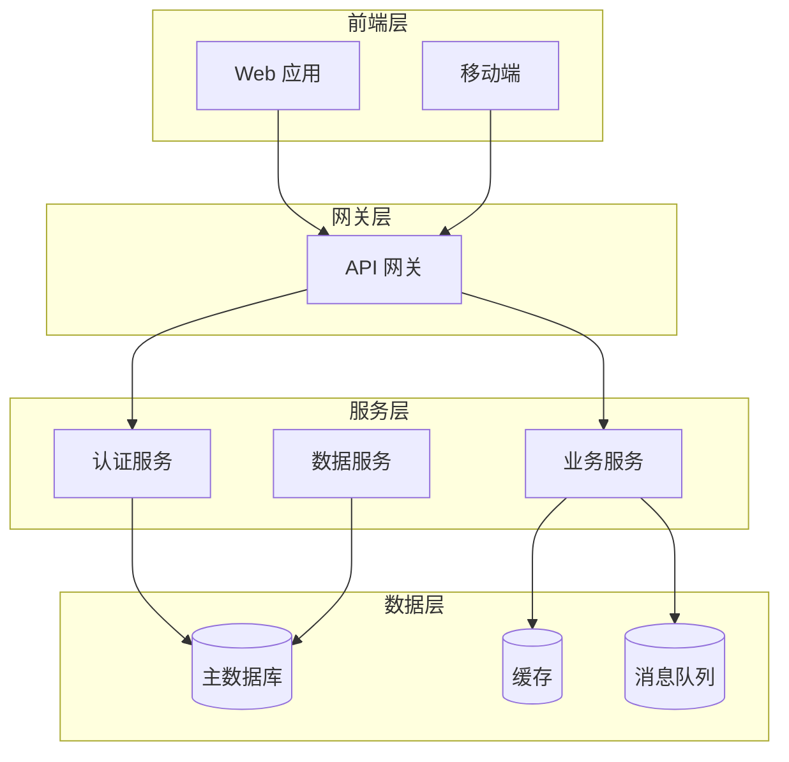
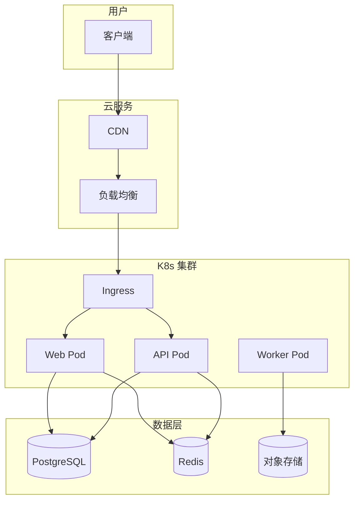

# /design - 方案详细设计

作为架构设计助手，对选定的方案进行深入设计。

## 使用方式

```
/design [方案描述]
/design 高可用微服务架构的详细设计
/design React 前端项目架构设计
/design 数据库架构设计
```

## 前置条件

运行 `/design` 前应已完成：
1. `/brainstorm` - 方案头脑风暴
2. `/compare` - 方案对比（如有多个）
3. `/[方案名]/decision.md` - 方案决策

## 执行流程

### 阶段 1: 设计准备

1. 读取方案决策文件
2. 确认设计范围和约束
3. 识别关键技术点

### 阶段 2: 架构设计

1. **系统架构图**
   - 组件划分
   - 层次结构
   - 交互关系

2. **数据架构**
   - 数据模型
   - 存储方案
   - 数据流

3. **接口架构**
   - API 设计
   - 协议选择
   - 安全策略

### 阶段 3: 详细设计

1. **组件设计**
   - 模块划分
   - 类/函数设计
   - 状态管理

2. **技术选型**
   - 框架版本
   - 依赖库
   - 基础设施

3. **非功能设计**
   - 性能设计
   - 安全设计
   - 可扩展设计

### 阶段 4: 风险评估

1. 识别技术风险
2. 评估影响程度
3. 制定缓解措施

### 阶段 5: 实施规划

1. 阶段划分
2. 里程碑定义
3. 依赖关系

## 设计内容

### 1. 系统架构图（Mermaid）



### 2. API 设计

#### RESTful API 规范

```markdown
## API 设计规范

### 基础信息
- Base URL: `/api/v1`
- 认证: Bearer Token
- 格式: JSON

### 端点定义

#### 用户管理
| 方法 | 路径 | 描述 |
|------|------|------|
| GET | /users | 获取用户列表 |
| GET | /users/:id | 获取用户详情 |
| POST | /users | 创建用户 |
| PUT | /users/:id | 更新用户 |
| DELETE | /users/:id | 删除用户 |

#### 认证
| 方法 | 路径 | 描述 |
|------|------|------|
| POST | /auth/login | 登录 |
| POST | /auth/logout | 登出 |
| POST | /auth/refresh | 刷新 Token |
```

### 3. 数据模型

#### 数据库设计

```markdown
## 数据模型

### 用户表 (users)
| 字段 | 类型 | 约束 | 说明 |
|------|------|------|------|
| id | UUID | PK | 用户 ID |
| email | VARCHAR | UNIQUE | 邮箱 |
| name | VARCHAR | NOT NULL | 名称 |
| password_hash | VARCHAR | NOT NULL | 密码哈希 |
| created_at | TIMESTAMP | DEFAULT | 创建时间 |
| updated_at | TIMESTAMP | | 更新时间 |

### 关系
- 用户 1:N 订单
- 用户 1:1 配置
```

### 4. 技术选型详情

| 类别 | 选型 | 版本 | 说明 |
|------|------|------|------|
| 前端框架 | React | 18.x | 函数式组件 |
| UI 库 | Ant Design | 5.x | 组件库 |
| 状态管理 | Zustand | - | 轻量级 |
| HTTP 客户端 | Axios | - | 请求库 |
| 后端框架 | Express | 4.x | Node.js |
| 数据库 | PostgreSQL | 15.x | 主数据库 |
| 缓存 | Redis | 7.x | 缓存层 |
| ORM | Prisma | 5.x | ORM 框架 |

### 5. 部署架构



## 输出位置

```
planning/designs/[方案名]/
├── README.md              # 设计概览
├── architecture.md        # 架构设计
├── api-spec.md            # API 规范
├── data-model.md          # 数据模型
├── tech-stack.md          # 技术选型
├── deployment.md          # 部署架构
└── diagrams/              # 图表
    ├── architecture.mermaid
    ├── sequence.mermaid
    ├── dataflow.mermaid
    └── deployment.mermaid
```

## 完整输出模板

```markdown
# [方案名] - 详细设计

## 文档信息
- 版本: 1.0
- 创建日期: YYYY-MM-DD
- 状态: 设计中

## 1. 概述

### 1.1 背景
[设计背景]

### 1.2 目标
[设计目标]

### 1.3 范围
[设计范围]

## 2. 架构设计

### 2.1 系统架构
[架构图 + 说明]

### 2.2 组件划分
| 组件 | 职责 | 技术 |
|------|------|------|
| XXX | XXX | XXX |

### 2.3 数据流
[数据流向说明]

## 3. 接口设计

### 3.1 API 规范
[API 端点列表]

### 3.2 数据格式
[请求/响应格式]

### 3.3 错误处理
[错误码定义]

## 4. 数据模型

### 4.1 核心实体
[实体关系图]

### 4.2 表结构
[表定义]

### 4.3 索引策略
[索引设计]

## 5. 技术选型

### 5.1 技术栈清单
| 层级 | 技术 | 版本 | 用途 |
|------|------|------|------|
| 前端 | XXX | x.x | UI 框架 |
| 后端 | XXX | x.x | 服务框架 |
| 数据库 | XXX | x.x | 数据存储 |

### 5.2 依赖库
[关键依赖列表]

## 6. 非功能设计

### 6.1 性能设计
- 缓存策略
- 性能指标

### 6.2 安全设计
- 认证授权
- 数据安全

### 6.3 可用性设计
- 容错策略
- 降级方案

## 7. 风险评估

| 风险 | 影响 | 概率 | 缓解措施 |
|------|------|------|----------|
| XXX | 高 | 低 | XXX |

## 8. 实施计划

### 阶段一：基础架构
- [ ] 任务 1
- [ ] 任务 2

### 阶段二：核心功能
- [ ] 任务 3
- [ ] 任务 4

## 9. 参考资料

- [文档1](url)
- [文档2](url)
```

## 与其他命令配合

| 命令 | 时机 | 用途 |
|------|------|------|
| `/brainstorm` | 设计前 | 方案探索 |
| `/compare` | 设计前 | 方案对比 |
| `/plan` | 设计后 | 制定计划 |
| `/next` | 任何时候 | 获取建议 |

## 激活的技能

| 技能 | 用途 |
|------|------|
| **diagram-maker** | 生成架构图 |
| **spec-interview** | 确认设计需求 |
| **planning-with-files** | 记录设计过程 |

## 注意事项

- **不过度设计**：只设计到足够实施的粒度
- **考虑变更**：为未来扩展留出空间
- **文档完整**：覆盖功能和 非功能需求
- **可视化优先**：尽量用图表表达
