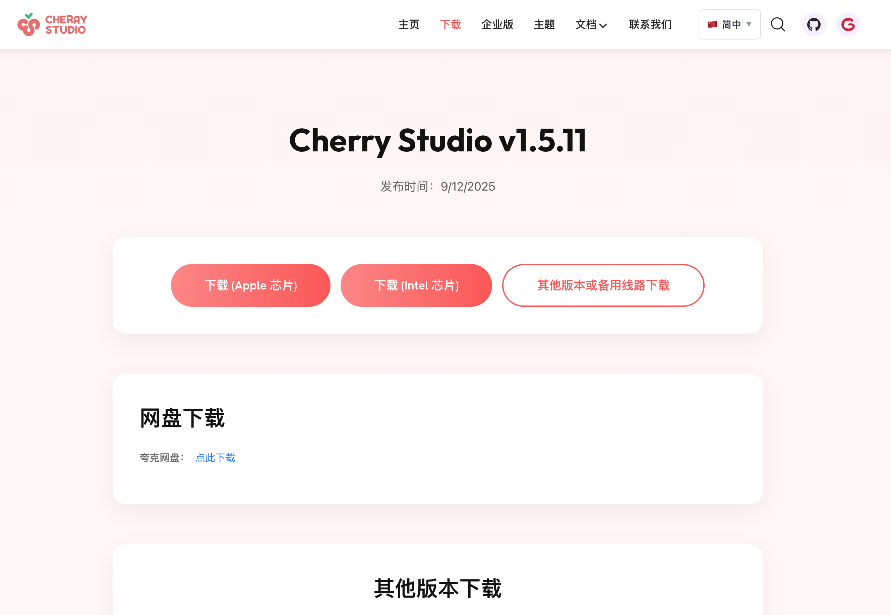
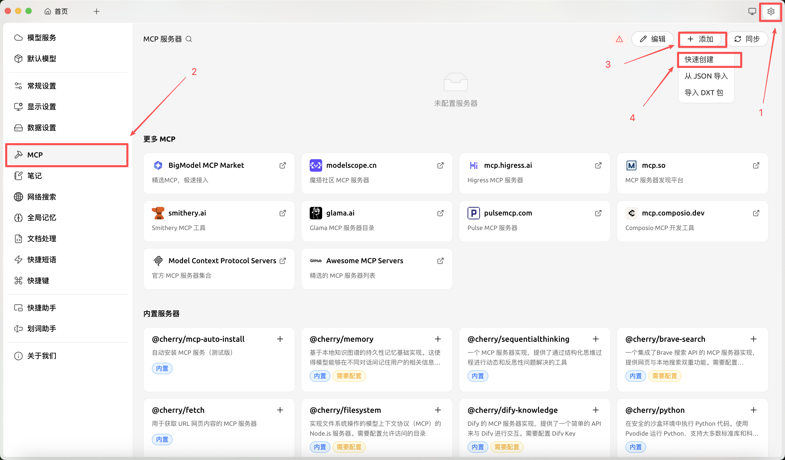
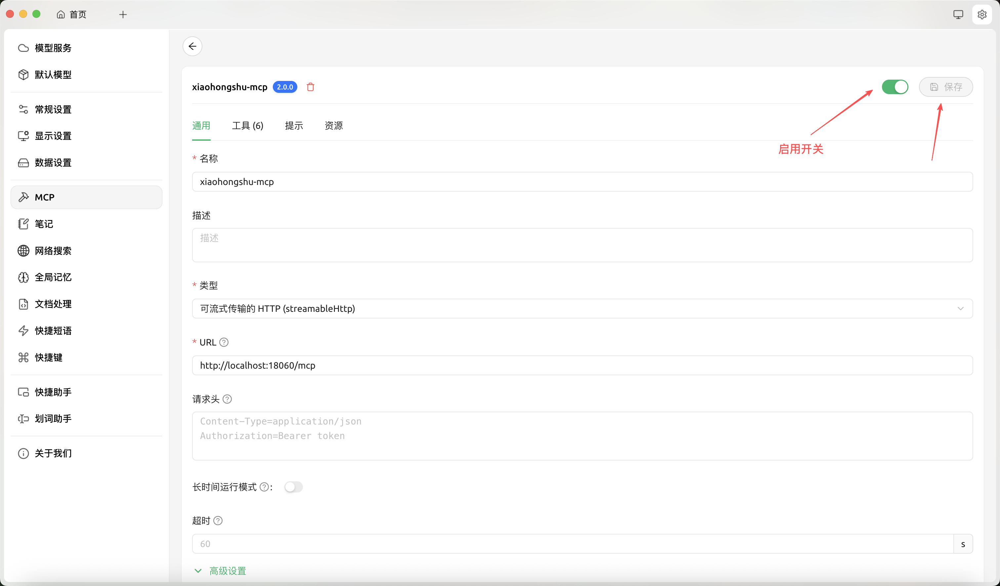
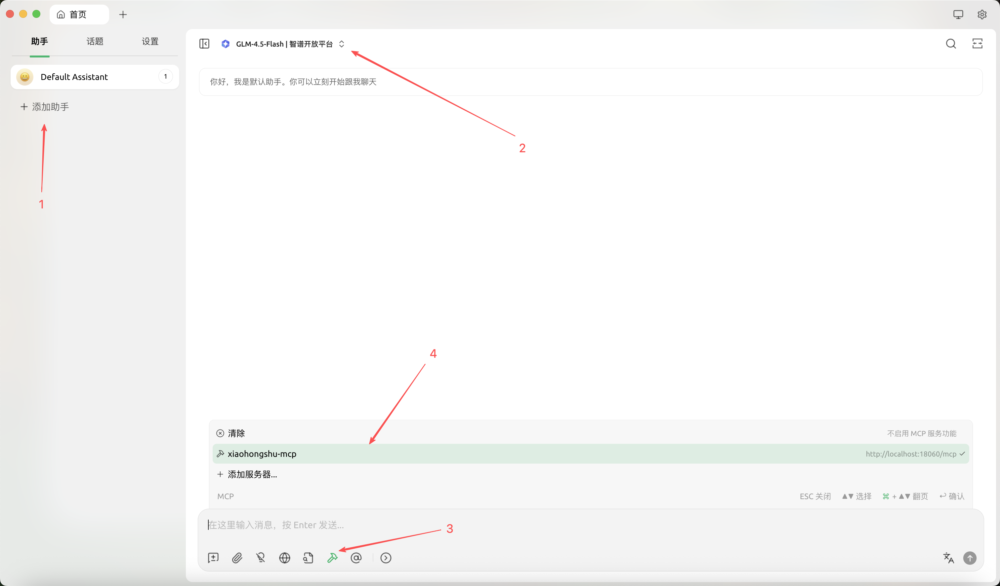
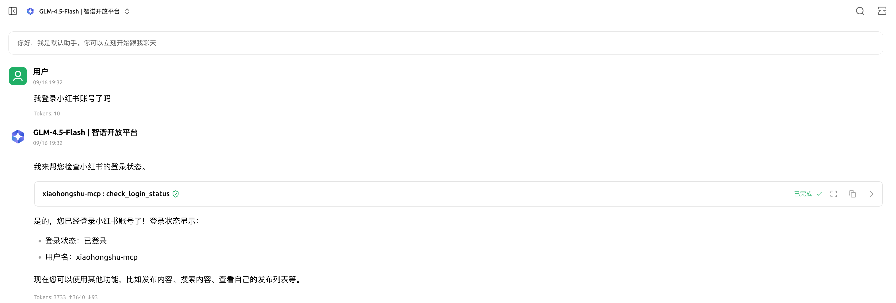
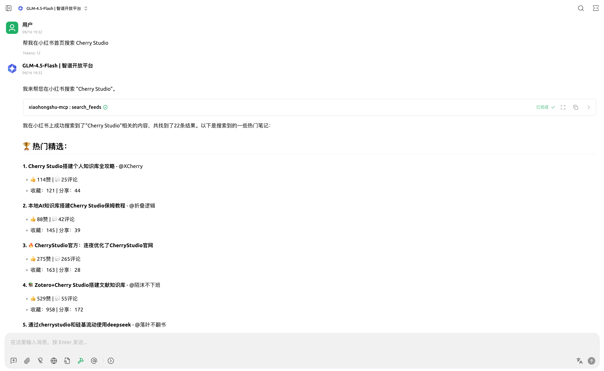
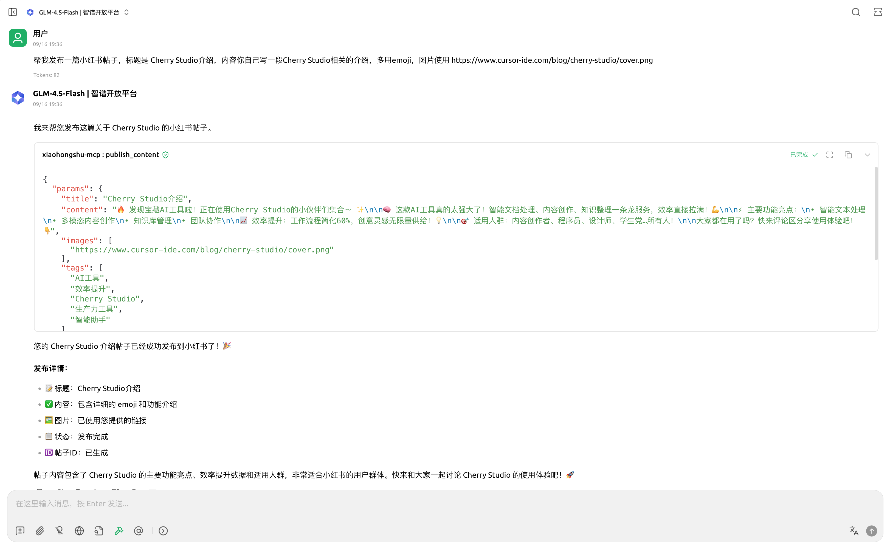
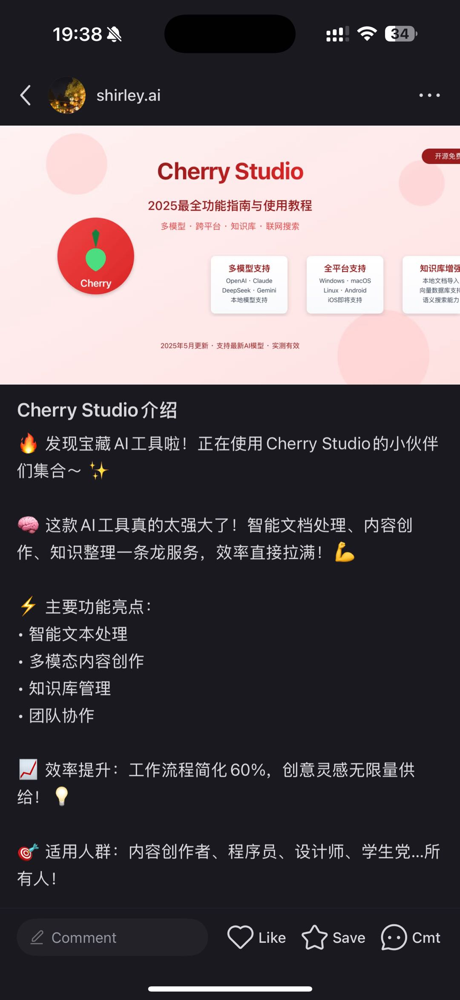

# Cherry Studio 接入 xiaohongshu-mcp 完整指南

## 📋 概述

Cherry Studio 是目前最热门的 AI 客户端之一，它简单易用且支持多种开源和闭源大模型。

通过 Cherry Studio 调用我们的 xiaohongshu-mcp 服务，您可以使用免费的开源大模型，无需 API key，无需复杂的配置文件，轻松实现小红书内容创作和发布功能。

## 🚀 Cherry Studio 安装

访问 [Cherry Studio 下载页面](https://www.cherry-ai.com/download) 下载适合您操作系统的安装包，按照提示安装即可。




## 🔌 配置 xiaohongshu-mcp 服务

### 步骤 1：启动 xiaohongshu-mcp 服务

#### 1.1 登录小红书账号

第一次使用需要手动登录，保存小红书的登录状态：

```bash
# 登录小红书账号
go run cmd/login/main.go
```

#### 1.2 启动 MCP 服务

登录成功后，启动 xiaohongshu-mcp 服务：

```bash
# 默认：无头模式，没有浏览器界面
go run .

# 或者：非无头模式，有浏览器界面（调试时使用）
go run . -headless=false
```

### 步骤 2：在 Cherry Studio 中添加 MCP 服务器

1. **打开 Cherry Studio 设置并添加 MCP 服务器**
   - 点击右上角齿轮图标进入设置
   - 选择 "MCP" 标签页
   - 点击 "添加" 按钮
   - 点击 "快速创建" 按钮



2. **配置新的 MCP 服务器**
   - 配置以下信息：
      * 名称: xiaohongshu-mcp
      * 类型: streamableHttp
      * URL: http://localhost:18060/mcp
   - 点击 "保存" 按钮
   - 点击启用开关



3. **测试连接**
   - 在上一步的配置页面点击 "工具" 按钮
   - 如果链接成功，可以看到所有可用的工具，并且可以选择启用哪些工具


## 🎯 使用指南

### 创建新对话并在对话中启用我们的 MCP 工具

- 返回首页，点击 "添加助手"
- 选择模型，这里默认使用开源的 GLM-4.5-Flash 模型
- 点击对话框下的工具 icon，勾选 xiaohongshu-mcp



### 通过对话使用 MCP 工具

Cherry Studio 配合 xiaohongshu-mcp 可以实现多种智能功能：

* 检查登录状态



* 小红书站内搜索



* 发布图文内容



* 发布成功



---

通过以上配置，您可以在 Cherry Studio 中高效地使用 xiaohongshu-mcp 服务，实现智能化的小红书内容创作和管理！